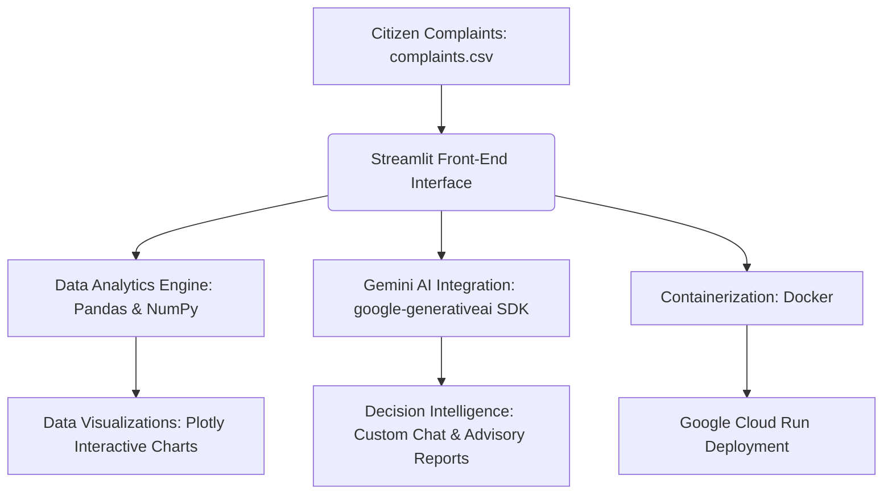
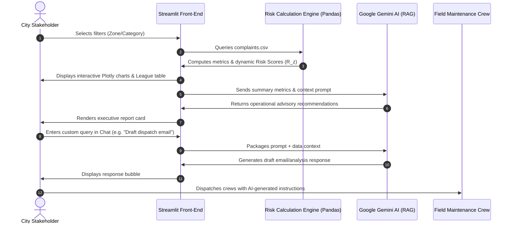
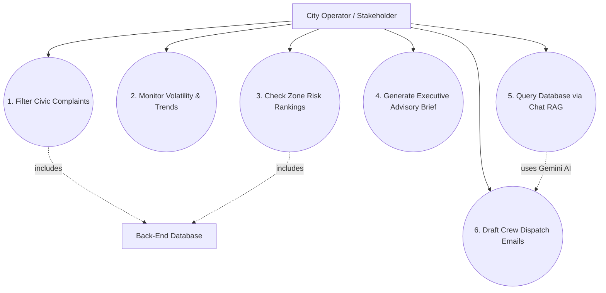
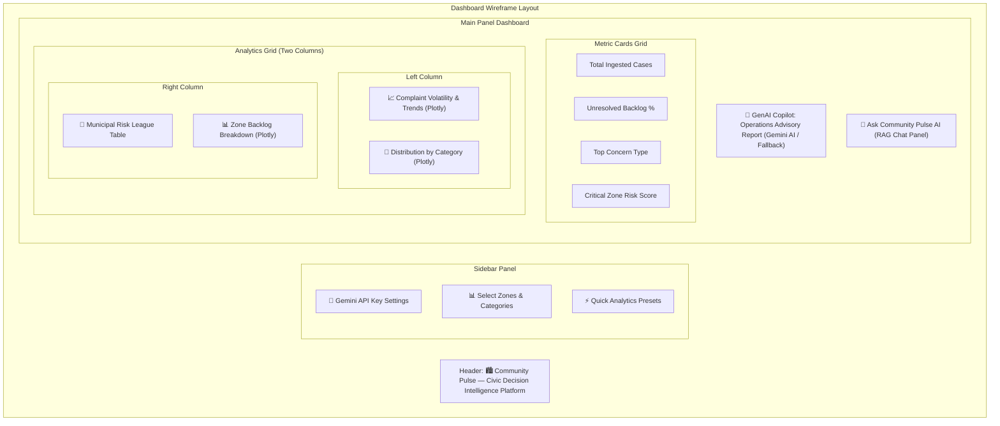

# 🏙️ Community Pulse — AI-Powered Civic Decision Intelligence Platform

<p align="center">
  
  
  
  
  
</p>

> **Gen AI APAC Cohort 2 Capstone Submission**
> 
> *Theme: AI for Better Living and Smarter Communities*

Community Pulse is a serverless Decision Intelligence Platform designed to empower municipal administrators, city stakeholders, and community advocates. By transforming unstructured citizen feedback, hotline complaints, and ticket data into actionable operational insights, the platform computes dynamic risk indices, drafts automated work orders, and answers complex queries in natural language in seconds.

---

## 🔗 Submission Credentials

| Submission Artifact | Link |
| :--- | :--- |
| 🌐 **Live Deployment Link** | [https://community-pulse-99.streamlit.app/](https://community-pulse-99.streamlit.app/) |
| 📂 **GitHub Repository** | [https://github.com/tirthgandhi9905/community-pulse](https://github.com/tirthgandhi9905/community-pulse) |
| 🎥 **Demo Video Link (max 3 min)** | `[Paste your shared Google Drive / Loom / YouTube video URL here]` |
| 📊 **Project Slide Deck** | Slides are structured slide-by-slide in [presentation_content.md](file:///d:/Projects/Genai-APAC/community-pulse/presentation_content.md) |

---

## 📖 The Problem
Smart cities gather massive streams of citizen reports (e.g., potholes, utility leaks, outages, illegal dumping). However, municipal command centers face major challenges:
1. **Response Latency**: Manually querying logs and building weekly reports takes hours, resulting in slow community response.
2. **Prioritization Blindspots**: Finding the exact zone collapsing under unresolved backlogs is difficult without standard risk scoring.
3. **Operational Bottlenecks**: Dispatch coordinators lack tools to rapidly draft field instructions, notifications, or update templates from raw spreadsheets.

**Community Pulse** solves this with a unified intelligence dashboard combining statistical indices with Large Language Models.

---

## 🛠️ How It Works: The Decision Engine



### 🔄 System Process Flow & Use Cases

#### Chronological Data & Decision Flow


#### Platform Use Case Mapping

 
#### Dashboard UI Wireframe Layout


### 🧮 Mathematical Risk scoring
Unlike generic reporting apps, Community Pulse calculates a dynamic **Composite Risk Score** ($R_z$) for each city zone:

$$R_z = \alpha \left(\frac{C_z}{\max(C)}\right) + \beta \left(B_z\right)$$

Where:
- $C_z$: Total complaints received in Zone $z$.
- $\max(C)$: Maximum complaint volume in any single zone (normalization factor).
- $B_z$: Unresolved backlog rate in Zone $z$ ($\frac{\text{Open Cases}}{\text{Total Cases}}$).
- $\alpha, \beta$: Weighting coefficients (tuned to $0.5$ / $0.5$ for balanced volume-backlog risk mapping).

This score dynamically guides dispatch managers to prioritize regions experiencing both high complaint volumes and low resolution rates.

---

## 🌟 Key Platform Features

- **💡 Dynamic Risk Scores**: Automatically aggregates datasets to rank and flag critical municipal zones.
- **📊 Plotly Visual Suite**: High-fidelity, interactive visualizations (Volatile Weekly Trends, Category Distribution, and Status Comparisons).
- **🤖 Autonomous Executive advisor**: Instantly reads the filtered dataset metrics and leverages Google Gemini to output a 4-bullet executive operational summary.
- **💬 Conversational RAG Copilot**: Users can type questions (e.g., *"What is the main concern in Zone E?"* or *"Draft a crew message about water leaks"*) to get immediate, data-driven answers.
- **🔌 Zero-Key Fallback**: Includes a built-in statistical mock engine. If no Gemini API key is configured, the chatbot and advisor continue to work flawlessly using local rule-based solvers.

---

## 🚀 Getting Started (Local Run)

### 1. Clone & Navigate
```bash
git clone https://github.com/tirthgandhi9905/community-pulse.git
cd community-pulse
```

### 2. Double-Click Setup (Windows Easiest)
Simply double-click the **`run_app.bat`** script. This Windows batch script will automatically:
- Create a Python virtual environment (`venv`).
- Activate it and install dependencies from `requirements.txt`.
- Run the Streamlit server and open the app in your web browser.

### 3. Manual Startup (All Platforms)
```bash
# Setup environment
python -m venv venv
source venv/bin/activate  # Or .\venv\Scripts\activate on Windows

# Install requirements
pip install -r requirements.txt

# Start Server
streamlit run app.py
```
Go to `http://localhost:8501`.

---

## 🐳 Containerization & GCP Cloud Run Deployment

To host this app on a scalable, serverless container platform like **Google Cloud Run**:

```bash
# 1. Build and submit container image to Google Artifact Registry
gcloud builds submit --tag gcr.io/<YOUR_PROJECT_ID>/community-pulse

# 2. Deploy to Cloud Run (automatically binds port 8080)
gcloud run deploy community-pulse \
    --image gcr.io/<YOUR_PROJECT_ID>/community-pulse \
    --platform managed \
    --region us-central1 \
    --allow-unauthenticated \
    --port 8080 \
    --set-env-vars="GEMINI_API_KEY=your_gemini_api_key_here"
```

---

## 🛡️ Responsible & Explainable AI Design
1. **Explainable Rules**: The weighting factors and risk formulas are fully documented and visible, preventing "black-box" decision bias.
2. **Citizen Privacy**: The platform processes aggregated complaint data (categories, zones, dates) and contains no Personally Identifiable Information (PII) like names or phone numbers.
3. **Human-in-the-Loop**: The conversational assistant acts as a *decision helper* (e.g., drafting template emails). It never automatically dispatches crews or sends public emails without supervisor approval.