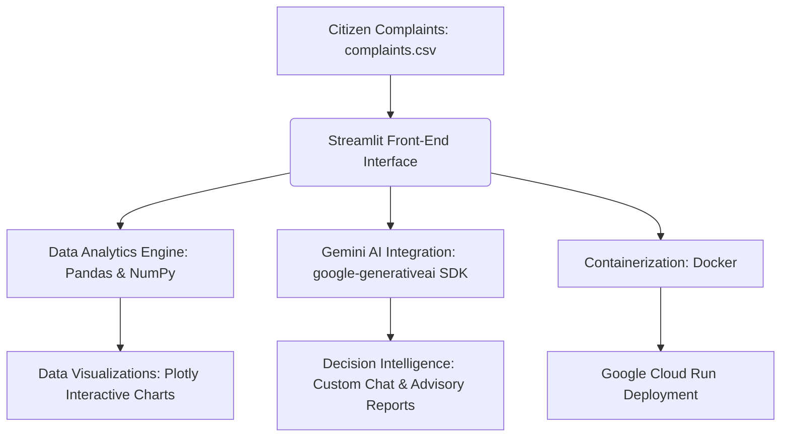

# 🏙️ Community Pulse — AI-Powered Civic Decision Intelligence Platform

> **Gen AI APAC Cohort 2 — AI for Better Living and Smarter Communities**

Community Pulse is a decision intelligence platform designed to help municipal authorities and city stakeholders transform raw citizen complaints into real-time operational insights, risk score maps, and automated crew dispatches. Leveraging Google Cloud's AI ecosystem (including Google Gemini models), it turns raw, messy civic data into immediate decision action, replacing hours of manual reports.

---

## 🔗 Submission Details

- **Deployment Link (Cloud Run)**: `[Paste your deployed URL here, e.g., https://community-pulse-xxxx.run.app]`
- **GitHub Repository Link**: `[Paste your GitHub repository link here]`
- **Demo Video Link (max 3 min)**: `[Paste your demo video link here]`
- **Project Slide Deck (PPT)**: Ready-to-copy content is structured in [presentation_content.md](file:///d:/Projects/Genai-APAC/community-pulse/presentation_content.md) inside this repository.

---

## 📖 Problem Statement
Modern smart cities collect massive amounts of structured and unstructured feedback through municipal hotlines, citizen portal logs, and utility monitoring systems. However, processing this data is slow and manual. Municipal managers struggle to:
1. **Assess risk dynamically** (which zone is collapsing under repair backlogs?).
2. **Prioritize operations** (what category of complaints has the highest resolution backlog?).
3. **Engage with data in plain language** (how can dispatch supervisors quickly query stats or write email updates?).

**Community Pulse** solves this by providing:
- A dynamic **Municipal Risk Score Index** that calculates priority levels for zones.
- Interactive charts tracking weekly volatility and category distribution.
- A **Gemini-powered RAG assistant** that answers complex queries in natural language, drafts field crew notifications, and predicts resolution trends.

---

## 🏗️ Architecture & Technology Stack



### Stack
- **Frontend**: Streamlit (Python-based dashboard)
- **Data Engine**: Pandas & NumPy (data ingestion & scoring matrix)
- **Visuals**: Plotly Express & Plotly Graph Objects (interactive charts)
- **Generative AI**: Google Gemini Pro / Flash 1.5 (`google-generativeai` SDK)
- **Infrastructure**: Docker & Google Cloud Run (scalable, serverless deployment)

---

## 🌟 Key Features
1. **Dynamic Risk Score Engine**: Aggregates complaints per zone, computes backlog rates, and outputs a normalized 0-1 risk coefficient.
2. **Interactive Visual Dashboard**: Includes trend volatility line charts and category donut charts powered by Plotly.
3. **GenAI Copilot**: Automatically generates an executive municipal advisory report outlining critical sectors and action recommendations.
4. **Conversational RAG Chat**: Allows users to chat with the data, query specifics, and write automated emails to field engineers.
5. **Robust Fallback Engine**: If no Gemini API Key is present, the app gracefully falls back to a smart mock analytics solver so it remains fully functional and visual out-of-the-box.

---

## 🚀 Getting Started (Local Development)

### 1. Clone the repository
```bash
git clone <your-repo-link>
cd community-pulse
```

### 2. Set up a Virtual Environment and Install Dependencies
```bash
# Create environment
python -m venv venv
# Activate environment (Windows)
.\venv\Scripts\activate
# Activate environment (macOS/Linux)
source venv/bin/activate

# Install requirements
pip install -r requirements.txt
```

### 3. Add Gemini API Key (Optional)
Create a `.env` file in the project root:
```env
GEMINI_API_KEY=your_gemini_api_key_here
```
*(Alternatively, you can input your key directly into the application sidebar when running).*

### 4. Run the Streamlit Application
```bash
streamlit run app.py
```
Open your browser and navigate to `http://localhost:8501`.

---

## 🐳 Containerization & Deployment

### 1. Build and Run Container Locally
To test the Docker configuration:
```bash
# Build the image
docker build -t community-pulse .

# Run the container
docker run -p 8080:8080 --env GEMINI_API_KEY=your_key community-pulse
```
Open your browser at `http://localhost:8080`.

### 2. Deploy to Google Cloud Run (Recommended)
You can deploy directly using the Google Cloud CLI in two simple commands:

```bash
# 1. Build and submit container image to Google Artifact Registry
gcloud builds submit --tag gcr.io/<YOUR_PROJECT_ID>/community-pulse

# 2. Deploy to Cloud Run (fully managed serverless containers)
gcloud run deploy community-pulse \
    --image gcr.io/<YOUR_PROJECT_ID>/community-pulse \
    --platform managed \
    --region us-central1 \
    --allow-unauthenticated \
    --port 8080 \
    --set-env-vars="GEMINI_API_KEY=your_gemini_api_key_here"
```

Once the deploy completes, the terminal will print a **Service URL** which is your publicly accessible deployment link.